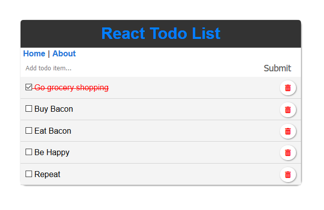

# React Todo App

## Description
This is an obligatory todo app built with React.  There's not much to it and it was built to reinforce my knowledge of the framework.  Feel free to do with it as you please :D

 This project was created with [Create React App](https://github.com/facebook/create-react-app).  Below you will find some helpful scripts as well as instructions on using this app yourself.

## Get It On Your Machine
Fork or download this repo and then run `npm install` in the project directory to install all dependencies and then follow the instructions below.

## Available Scripts

In the project directory, you can run:

### `npm start`

Runs the app in the development mode. 
Open [http://localhost:3000](http://localhost:3000) to view it in the browser.

The page will reload if you make edits. 
You will also see any lint errors in the console.

### `npm test`

Launches the test runner in the interactive watch mode. 
See the section about [running tests](https://facebook.github.io/create-react-app/docs/running-tests) for more information.

### `npm run build`

Builds the app for production to the `build` folder. 
It correctly bundles React in production mode and optimizes the build for the best performance.

The build is minified and the filenames include the hashes. 
Your app is ready to be deployed!

See the section about [deployment](https://facebook.github.io/create-react-app/docs/deployment) for more information.

## Learn More

You can learn more in the [Create React App documentation](https://facebook.github.io/create-react-app/docs/getting-started).

To learn React, check out the [React documentation](https://reactjs.org/).

